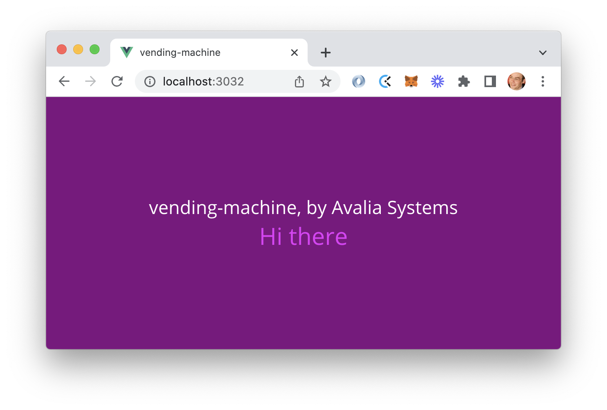

!!! tip "Edit this documentation locally"
    You can easily edit this documentation and get a preview on your local machine. You only have to clone the [${{ values.name }} git repository](https://bitbucket.org/avaliasystems/${{ values.name }}) and run a script that we provide. You will get a preview both in a Backstage-like layout and in a mkdocs layout.
    
    Edit the markdown files, and you will immediately get the results. Commit your changes and the information will automatically be updated in DX Hub!



## Functional description

### Purpose

The ${{ values.name }} system was generated with a DX Hub template. At the moment, it still shares the same purpose of the template: demonstrate how design, build and deploy a system following the Avalia reference architecture.

!!! note "Up to you!"
    This is obviously only the starting point: if you have created this new system, it is because you want to solve a problem. Take the time to describe this problem here, and how the system intends to address it.

### Target users

This system is for internal usage, and is used only within Avalia Systems. The main users are the experts.

### Features

At the moment, the ${{ values.name }} system offers a simple feature: it allows users to visit a web page and to see a greeting message.

The message is refreshed periodically. It is generated by the ${{ values.name }}-backend component. The objective is only to demonstrate the interaction between the frontend and the backend via the REST API.

## Getting started

To test the system, you need to build and run both the ${{ values.name }}-backend and ${{ values.name }}-frontend components. 

You will find two utility scripts to do that. Open 2 terminals and type the following commands:

```
./run-backend.sh
```

```
./run-frontend.sh
```

You can also edit this documentation and get a local preview with a third utility script:

```
./run-techdocs-locally.sh
```

!!! warning "Watch out for TCP ports"
    By default, the ${{ values.name }}-backend component listens on port 8080, and the $ {{ values.name }}-frontend component listens on port 3030. If you encounter errors, make sure that these ports are not used by other processes.
